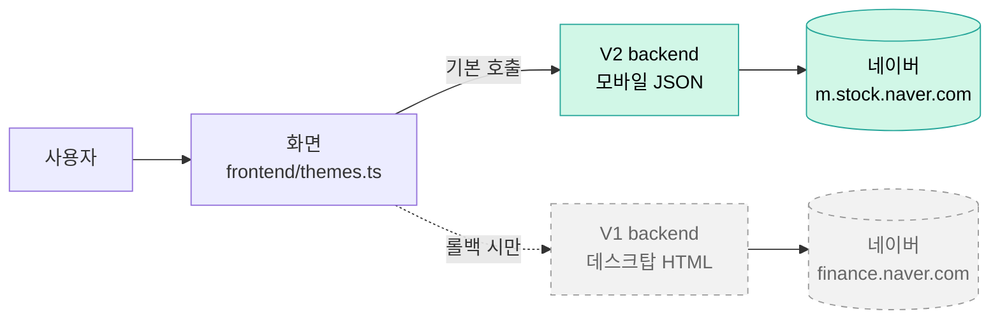

# 테마 분석 기능 — 비개발자용 가이드

> 한 줄 요약: "비슷한 회사들끼리 묶어서 시장 흐름을 보는 도구"를 만들고, 더 좋은 데이터 통로로 두 번 갈아탄 이야기.

이 가이드는:
- 코드는 잘 모르지만 "테마 분석 탭이 뭐고, 왜 이렇게 만들어졌는지" 알고 싶은 분
- 향후 비슷한 작업이 필요할 때 어떤 결정이 있었는지 빠르게 훑고 싶은 분
- 한 페이지로 SPEC-NAVER-THEME-001 / 002 / 003 변천사를 따라가고 싶은 분

을 위해 작성되었습니다.

---

## 1. "테마 분석"이 뭔가요?

주식 시장에는 비슷한 일을 하는 회사들끼리 묶어서 부르는 이름이 있습니다. 예를 들어:

- **전선 테마**: LS전선·대한전선처럼 케이블 만드는 회사들
- **AI 테마**: 엔비디아 협력사, AI 칩 설계 등 인공지능 관련 회사들
- **바이오 테마**: 신약 개발, 의료기기 회사들

"테마 분석" 탭은 이런 그룹을 가져와서 다음을 한눈에 보여줍니다:

- 오늘 / 3일간 어느 그룹이 많이 올랐는지 (강세 테마)
- 그 그룹 안에서 누가 주도주(가장 강한 종목)인지
- 한 종목이 여러 테마에 동시에 들어가 있는지

신문 경제면의 "오늘의 주도 테마"를 자동으로 끌어와 정리한 셈입니다.

---

## 2. 어디서 데이터를 가져오나요?

네이버 금융(`finance.naver.com` 또는 `m.stock.naver.com`)이 매일 정리해 주는 테마 페이지에서 가져옵니다. 별도 API 비용은 들지 않습니다.

다만 한 가지 주의할 점:
- 네이버는 "이 페이지를 데이터로 가져가도 된다"고 공식 약속한 곳이 아닙니다 (비공식 endpoint).
- 따라서 페이지 구조가 바뀌면 갑자기 데이터가 못 들어올 수 있습니다.
- 이런 상황에서 화면이 멈추지 않게 "다시 시도" 버튼을 두어, 사용자가 직접 한 번 더 시도할 수 있게 했습니다 (D-1 결정 — 아래 §5 참고).

---

## 3. V1 → V2 변천사 (왜 두 번 갈아탔나요?)

### 시작점 — SPEC-NAVER-THEME-001 = V1 (2026-04 ship)

처음에는 네이버 금융 **데스크탑 페이지**(`finance.naver.com/sise/theme.naver`)에서 데이터를 긁어왔습니다. 이 페이지는 사람이 읽는 형식(HTML)이라:
- 글자를 한 줄씩 추출해서 정리해야 했고,
- 한국어 글자가 깨지지 않게 EUC-KR이라는 옛날 인코딩도 따로 처리했습니다.

이렇게 V1을 출시한 후, 사용자께서 발견하셨습니다:

> "어? 네이버 모바일 페이지가 데스크탑보다 더 풍부해 — 테마 자체 설명, 종목별 편입 이유, 시가총액까지 다 들어 있네!"

### 두 번째 단계 — SPEC-NAVER-THEME-002 = V2 backend (2026-04 ship)

모바일 페이지(`m.stock.naver.com`)는 사람이 읽는 HTML이 아니라, 기계가 읽기 좋은 깔끔한 데이터(JSON)를 바로 주는 통로(API)가 있었습니다. 이 통로를 쓰면:
- 데이터가 더 풍부 (테마 설명, 종목 설명 등)
- 한국어 글자 깨짐 처리 불필요 (UTF-8 표준)
- 코드가 단순해짐

그래서 **V1을 그대로 두고** "V2"라는 이름의 새 데이터 통로를 추가했습니다. 이때 가장 중요한 정책 한 가지:

- **V1 코드는 한 줄도 건드리지 않는다** (REQ-NT2-C-002).
- V2가 잘 안 되면 즉시 V1으로 돌아갈 수 있도록 안전망 확보.

### 세 번째 단계 — SPEC-NAVER-THEME-003 = V2 frontend (2026-05-06 ship, 본 작업)

V2 backend는 만들어졌지만, 사용자 화면(frontend)은 여전히 V1만 쓰고 있었습니다. SPEC-003에서는 화면이 **V2 통로를 쓰도록 갈아탔고**, V2가 추가로 주는 데이터(테마 설명)를 화면에 노출했습니다.

```
2026-04  SPEC-001 V1 출시 (데스크탑 HTML)
         │
         │  💡 사용자: "모바일 페이지가 더 풍부하네!"
         ▼
2026-04  SPEC-002 V2 backend 추가 (모바일 JSON 통로)  + V1은 그대로 살려둠
         │
         │  ⏸ 화면이 아직도 V1 사용 중 (backend 통로만 V2로 준비됨)
         ▼
2026-05  SPEC-003 V2 frontend 채택 (화면이 V2 통로 사용)  ← 지금 여기
         │
         │  ⏭ 후속 작업 후보
         ▼
        SPEC-?-CACHE: 호출 캐시 정책 (속도 개선)
        SPEC-?-V1-CLEANUP: V1 통로 제거 (안전 확인 후)
        SPEC-?-MOBILE-UX: 모바일 화면에서도 테마 설명 보이게
```

---

## 4. V1과 V2를 동시에 살려두는 이유 (Cohabitation)

비유하자면 "전기 두 줄을 깔아두고 한 줄만 쓰는 것"과 같습니다.

- **메인선 (V2)**: 평소에 사용 — 더 많은 데이터, 더 빠른 처리
- **예비선 (V1)**: 등록만 되어 있고 평소에는 호출 안 함 — V2가 갑자기 망가질 때 즉시 갈아탈 수 있는 안전장치

코드 한 줄(`frontend/src/api/themes.ts`의 URL)만 V1으로 되돌리면 즉시 복귀할 수 있습니다.

이 정책 덕분에:
- V2 변경이 잘못되어도 사용자 화면이 완전히 죽지 않음
- 새 단계 도입 동안에도 안전망 확보
- 추후 "V1 진짜 안 쓰니 제거하자"는 별도 SPEC으로 깔끔하게 정리 가능

---

## 5. 작업하면서 한 4가지 결정 (D-1 ~ D-4)

SPEC-003 작업을 시작할 때 4가지를 미리 정해두었습니다. 사용자께서 "이렇게 가자"라고 사전 잠금하신 결정들로, 덕분에 RUN 단계에서 추가 질문 없이 한 번에 진행됐습니다.

### D-1: V2 통로가 막혔을 때 — 자동 복귀 vs 수동 다시 시도?

**선택**: 수동 다시 시도 (에러 메시지 + "다시 시도" 버튼)

**왜?**
- V1과 V2는 데이터 모양이 약간 달라서, 자동 복귀하려면 화면이 두 가지를 모두 처리하는 코드가 필요 → 복잡도 증가, 버그 risk 증가
- 사용자 입장에서는 "지금 뭔가 안 됐구나, 잠시 후 다시 클릭"이 가장 명확함
- 자동으로 V1로 돌아가면 사용자가 못 알아챌 수 있어 오히려 위험

### D-2: 테마 설명을 화면 어디에 노출할까?

**선택**: 테마 이름에 마우스를 올리면 나타나는 작은 풍선 (hover tooltip)

**왜?**
- 별도 컬럼을 추가하면 테이블이 옆으로 길어져서 좁은 모니터 사용자에게 불편
- 다른 가능성: Radix Tooltip 같은 라이브러리 도입 → "신규 의존성 0건" 정책 위배
- 가장 단순한 방법: 브라우저가 기본 제공하는 `title` 속성 사용 (라이브러리 0개)

### D-3: 종목별 편입 설명을 어느 자리에 표시할까?

**선택**: 기존에 "편입사유"를 보여주던 자리(V1)를 그대로 재사용

**왜?**
- V1에서는 "편입사유"라는 짧은 텍스트가 종목 행에 마우스 올리면 나왔음
- V2는 같은 자리에 더 풍부한 "편입설명"을 채워서 보내줌 (백엔드가 두 컬럼을 같은 source에서 채우도록 설계)
- 따라서 화면 코드를 한 줄도 안 바꿔도, V2 통로로 갈아타기만 하면 자동으로 더 풍부한 설명이 표시됨
- 변경 0줄 = 회귀 risk 0

### D-4: 데이터가 비어있을 때 (테마 설명이 null) — 어떻게 표시?

**선택**: 아예 안 보여줌 (hidden)

**왜?**
- 264개 테마 중 일부는 설명이 없을 수 있음
- "(설명 없음)" 같은 빈 자리 텍스트를 100개씩 띄우면 화면 노이즈
- 그냥 풍선이 안 뜨면 사용자도 "아 데이터 없구나" 자연스럽게 인식

---

## 6. 화면 흐름도



녹색 = 평상시 사용 / 회색 점선 = 롤백 시에만 사용

---

## 7. 자주 묻는 질문 (FAQ)

**Q1. V1을 왜 안 지우나요?**

V2가 갑자기 막힐 가능성을 대비한 안전장치입니다. 추후 별도 SPEC에서 V2가 충분히 안정됐다고 판단되면 정리합니다.

**Q2. V2가 더 좋다면 처음부터 V2로 시작하지 그랬나요?**

SPEC-001 작성 시점에는 V1(데스크탑 HTML)이 가장 보편적인 방법이었고, 모바일 API의 존재는 V1 출시 이후에 사용자께서 발견하셨습니다.

**Q3. 모바일에서 hover tooltip이 뜨나요?**

안 뜹니다. 브라우저가 기본 제공하는 `title` 속성은 마우스 hover 전용이라, 터치만 가능한 모바일에서는 동작하지 않습니다. 모바일 사용자용 표시는 별도 SPEC에서 다룰 예정입니다.

**Q4. 테마가 갑자기 안 보여요. 무슨 문제죠?**

화면에 "테마 데이터를 가져오지 못했습니다. 다시 시도해 주세요" 메시지와 [다시 시도] 버튼이 떴다면, 일시적 네트워크 또는 네이버 측 문제일 가능성이 높습니다. 잠시 후 버튼을 누르면 됩니다. 그래도 안 되면 V1 endpoint(`themes.ts` URL을 `/themes/snapshot`으로 되돌리기)로 임시 롤백 가능합니다.

**Q5. V2 통로 데이터에 추가된 게 뭐가 있나요?**

두 가지가 새로 들어옵니다:
- 테마 자체의 설명 (예: "각종 전선 및 전람(電纜)제조 ...")
- 종목별 편입 설명 (예: "전선 제조사로 자동차 와이어하네스 등 다각화")

**Q6. 가끔 화면 위에 "오늘 14:00:00 | 테마 264개 | 32.5초" 같은 줄이 보이는데 이게 뭔가요?**

데이터를 언제 가져왔고, 몇 개 테마를 봤고, 가져오는 데 몇 초 걸렸는지 알려주는 표시입니다. V2 통로로 갈아타면서 이 숫자들이 잘 들어오도록 backend도 함께 손봤습니다 (V1 alias 4 필드 — `collected_at`, `theme_count`, `stock_count`, `elapsed_sec`).

**Q7. SPEC-001/002/003은 언제까지 머지(통합)되나요?**

본 작업까지는 `chore/integrated-main-merge-2026-04-25` 브랜치에 누적되어 있고, GitHub PR #4(통합 머지)에 자동 누적됩니다. PR을 메인 브랜치(main)에 병합하는 시점은 사용자께서 GitHub에서 직접 결정합니다.

---

## 8. 용어집

| 용어 | 비개발자용 풀이 |
|---|---|
| SPEC | 이 작업의 명세서 — "무엇을, 왜, 어떻게" 미리 합의한 문서 |
| V1 / V2 | 1차 버전 / 2차 버전 — 데이터 가져오는 통로 |
| frontend | 사용자 화면 (브라우저에 보이는 부분) |
| backend | 서버 (데이터를 모아서 화면에 전달하는 부분) |
| API / endpoint | 서버에 데이터를 요청하는 길 (URL) |
| HTML / JSON | 데이터 모양 — HTML은 사람이 보는 웹페이지, JSON은 기계가 읽기 좋은 정리된 형태 |
| crawler | 웹페이지에서 데이터를 긁어오는 도구 |
| parser | 긁어온 데이터를 정리해 주는 도구 |
| tooltip | 마우스 올리면 뜨는 작은 풍선 |
| cohabitation | 동거 — V1과 V2가 동시에 살아있는 상태 |
| rollback | 되돌리기 — V2 → V1으로 복귀 |
| race condition | 빠른 요청 두 개가 엉켜서 잘못된 화면을 보여주는 버그 |
| TDD / RED-GREEN-REFACTOR | 테스트 먼저 만들고 → 통과시키는 코드 만들고 → 정리 — 개발 방식 |
| AC (Acceptance Criteria) | 합격 기준 — "이 작업이 잘 됐다고 하려면 이 모든 게 통과해야 한다" |
| @MX | 코드 안에 다는 메모지 — 미래 작업자(또는 AI)가 빨리 알 수 있게 |

---

## 9. 참고 문서

- 정식 명세서:
  - `.moai/specs/SPEC-NAVER-THEME-001/spec.md` (V1 v1.0.0)
  - `.moai/specs/SPEC-NAVER-THEME-002/spec.md` (V2 backend v1.0.1)
  - `.moai/specs/SPEC-NAVER-THEME-003/spec.md` (V2 frontend v1.0.0)
- 변경 이력: `CHANGELOG.md`
- 시리즈 회고 / 교훈: `.moai/learnings/SPEC-NAVER-THEME-001-003-lessons.md`
- V2 핸드오프 문서 (V2 backend → V2 frontend 전환 입력): `.moai/specs/SPEC-NAVER-THEME-002/handoff-frontend-v2.md`
- 일반 정책 (TRUST 5 등): `.claude/rules/moai/core/moai-constitution.md`

---

Last updated: 2026-05-06 (SPEC-NAVER-THEME-003 ship 직후)
